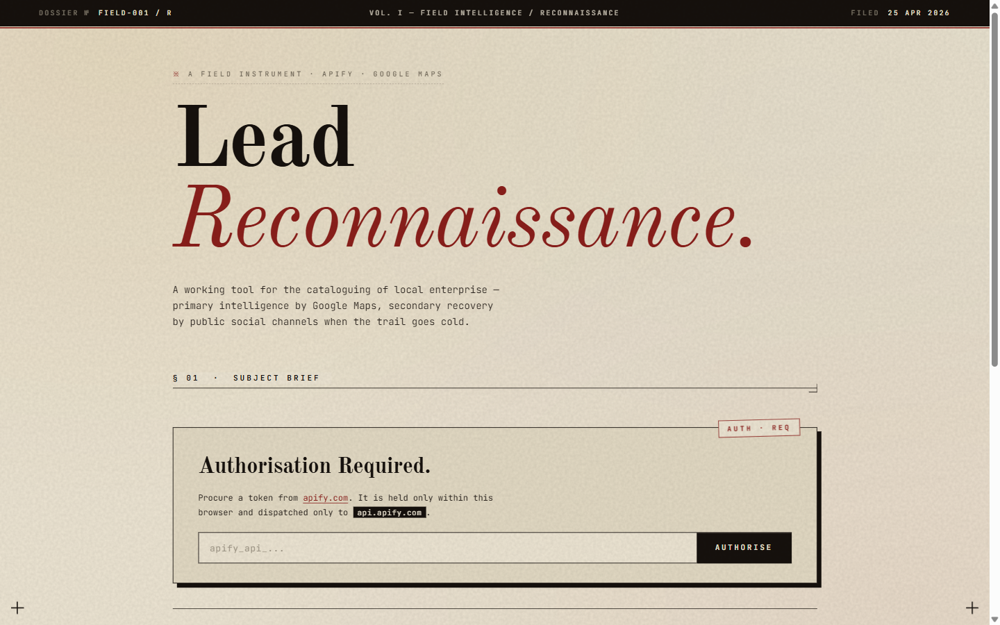
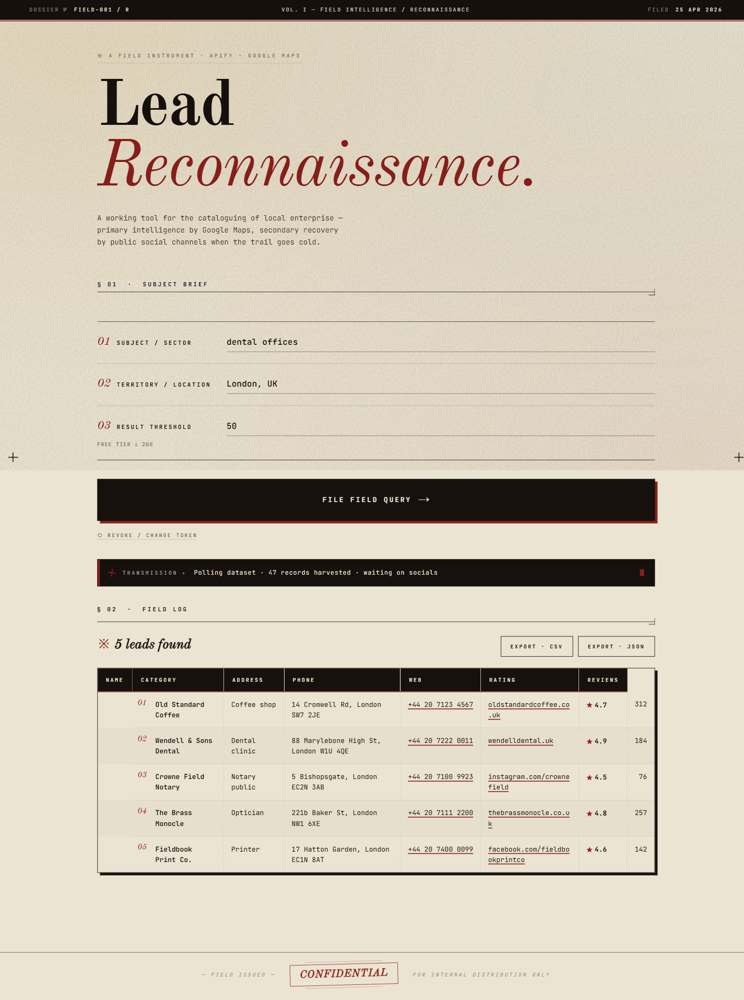
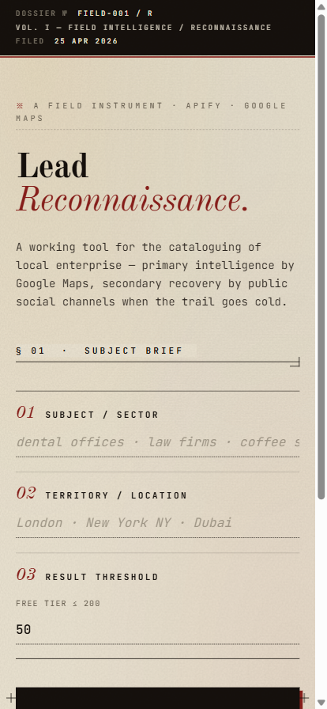

# Lead Generation

A browser-based lead generation tool that turns a business type and location into a clean table of business contacts. Enter something like "law firms" + "Singapore", and the app calls Apify's Google Maps scraper to return names, addresses, phone numbers, websites, ratings, and review counts. For any lead missing a website, a second Apify run searches Google for the business's Facebook, Instagram, or TikTok page and fills it in automatically.

Built for solo operators and small teams who want a fast, no-signup lead list they can export to CSV or JSON.

## Features

- Business-type + location form with input validation
- Live status updates while the Apify run is in progress
- Results table with name, category, address, phone, website, rating, review count
- Click-to-call phone numbers and click-through website links
- Automatic social-profile fallback (Facebook / Instagram / TikTok) when a business has no website listed
- One-click CSV export and JSON export
- Friendly error states for missing API key, network errors, invalid keys, failed runs, zero results
- Distinctive "Dossier" UI — editorial serif typography, ledger-numbered fields, registration marks, terminal-style transmission status

## Tech Stack

- HTML, CSS, JavaScript — no framework, no build step
- Old Standard TT (display) + JetBrains Mono (UI) via Google Fonts
- Apify REST API v2
  - Actor `compass~crawler-google-places` (Google Maps lead source)
  - Actor `apify~google-search-scraper` (social profile fallback)
- GitHub Actions + GitHub Pages for hosting

## Setup

1. Clone the repo:
   ```
   git clone https://github.com/poompamela-design/Lead-Generation.git
   cd Lead-Generation
   ```
2. Get an Apify API token from [apify.com](https://apify.com/) (free tier works for small runs).
3. Create `config.js` in the project root (this file is git-ignored):
   ```js
   window.APIFY_CONFIG = {
     apiKey: 'apify_api_YOUR_TOKEN_HERE'
   };
   ```
4. Open the app — either of these works:
   - **Direct:** double-click `index.html` (file:// is fine).
   - **Local server:** `npx serve .` or `python -m http.server 8000` then visit `http://localhost:8000`.
5. Hard-refresh (Ctrl+Shift+R) after editing any source file to bypass the browser cache.

## Screenshots





<p align="center">
  
</p>

## Deployment

The site auto-deploys to GitHub Pages on every push to `main` via the workflow at [`.github/workflows/deploy.yml`](.github/workflows/deploy.yml). The first deployment after enabling Pages can take 1–2 minutes.

## Live Demo

https://poompamela-design.github.io/Lead-Generation/

> Note: the live demo requires you to add your own Apify API key — the app prompts for one on load and stores it in `localStorage`. The hosted site does not ship a key.
